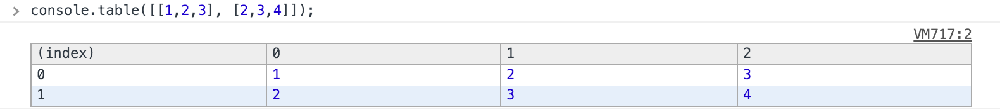
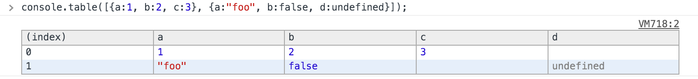
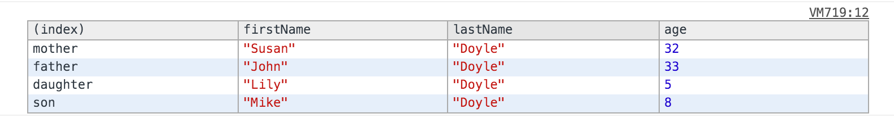

# Console API
*Origin Links: <https://developer.chrome.com/devtools/docs/console-api>, <https://developer.chrome.com/devtools/docs/console>, <https://developer.chrome.com/devtools/docs/commandline-api>*

## Console Format Specifier
Format Specifier    | Description
:-------------------| :-----------
%s                  | Formats the value as a string.
%d or %i            | Formats the value as an integer.
%f                  | Formats the value as a floating point value.
%o                  | Formats the value as an expandable DOM element.
%O                  | Formats the value as an expandable JavaScript object.
%c                  | Formats the output string according to CSS styles you provide.

## Console API Reference

* **console.log(object [, object, ...])**
    The behavior of calling console.log is equivalent to calling console.dir on Javascript object(non-DOM), or calling console.dirxml on HTML element(DOM).

* **console.info(object [, object, ...])**
* **console.debug(object [, object, ...])**
* **console.warn(object [, object, ...])**
* **console.error(object [, object, ...])**
* **console.dir(object)**
* **console.dirxml(object)**

---
* **console.table(object[, object])**

    > console.table([[1,2,3], [2,3,4]]);
    > console.table([{a:1, b:2, c:3}, {a:"foo", b:false, d:undefined}]);
    
    
    

    ```js
    function Person(firstName, lastName, age) {
        this.firstName = firstName;
        this.lastName = lastName;
        this.age = age;
    }
    var family = {};
    family.mother = new Person("Susan", "Doyle", 32);
    family.father = new Person("John", "Doyle", 33);
    family.daughter = new Person("Lily", "Doyle", 5);
    family.son = new Person("Mike", "Doyle", 8);
    console.table(family, ["firstName", "lastName", "age"]);
    ```
    

---
* **console.group(object[, object, ...])**
* **console.groupCollapsed(object[, object, ...])**
* **console.groupEnd()**

---
* **console.assert(expression, object)**
    If the specified expression is false, the message is written to the console along with a stack trace. Failing expressions are `false`, `0`, `null`, or `undefined`.

    > console.assert(false, "value of expression is false");

---
* **console.count(label)**

    > console.count("Executed times:");

* **console.time(label)**
* **console.timeEnd(label)**

    ```js
    console.time("Array initialize");
    var array= new Array(1000000);
    for (var i = array.length - 1; i >= 0; i--) {
        array[i] = new Object();
    };
    console.timeEnd("Array initialize");
    ```

* **console.timeStamp([label])**

---
* **console.profile([label])**
* **console.profileEnd()**

    ```js
    console.profile("init")
    console.profileEnd("init")
    ```

* **console.trace(object)**
    Prints a stack trace from the point where the method was called, including links to the specific lines in the JavaScript source. 

---
* **console.clear()**

---
**debugger**
The global debugger function causes Chrome to stop program execution and start a debugging session at the line where it was called. 
**Note:** The debugger command is not a method of the console object.

## Command Line API Reference

* **`$_`**
    Returns the value of the most recently evaluated expression.

* **`$0 - $4`**
    Dev Tools remembers the last five DOM elements (or JavaScript heap objects) those are marked as from $0 to $4. that you've selected in the tab (or Profiles panel). It makes those objects available as `$0`, `$1`, `$2`, `$3`, and `$4`.

* **`$(selector)`**
    An alias for `document.querySelector()`.

* **`$$(selector)`**
    An alias for `document.querySelectorAll()`.

* **`$x(path)`**
    Returns an array of DOM elements that match the given XPath expression.

* **copy(object)**
    Copies a string representation of the specified object to the clipboard.

* **debug(function)**
* **undebug(function)**
* **inspect(object/function)**
* **getEventListeners(object)**
* **keys(object)**
* **values(object)**
* **monitor(function)**   
* **unmonitor(function)**
* **monitorEvents(object[, events])**
    You specify a single event or events array to the second parameter.You can also specify one of the available event "types", strings that map to predefined sets of events. More info check a table [here](web-events.html).

* **unmonitorEvents(object[, events])**

