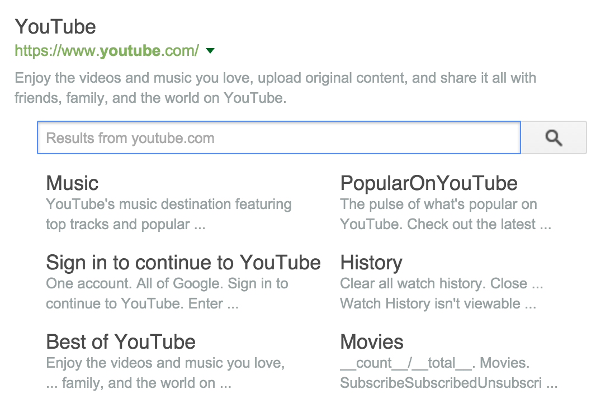

## Meta tags that Google understands

*Origin Link: <https://support.google.com/webmasters/answer/79812>*

Note:
* Google can read both **HTML** and **XHTML**-style meta tags, regardless of the code used on the page.
* With the exception of **verify**, case is generally not important in meta tags.

### Provide descriptive information

[HTML Improvements page](https://www.google.com/webmasters/tools/html-suggestions) shows you potential issues Google found when crawling and indexing your site. It will check these data:
* Title problems: otential problems with the title tag on your pages, such as missing or repeated page titles.
* Meta description problems: Potential problems with duplicate or otherwise problematic meta descriptions.
* Non-indexable content: Pages containing non-indexable content, such as some rich media files, video, or images.

#### description
> &lt;meta name="description" content="A description of the page" /&gt;

This tag provides a short description of the page. In some situations this description is used as a part of the snippet shown in the search results.

#### title
> &lt;title&gt;The Title of the Page&gt;/title&lt;

While technically not a meta tag, this tag is often used together with the "description". The contents of this tag are generally shown as the title in search results (and of course in the user's browser).

### Robots meta tag

The list of google robots:
* Googlebot
* Googlebot-News(Googlebot)
* Googlebot-Image(Googlebot)
* Googlebot-Video(Googlebot)
* Googlebot-Mobile
* Mediapartners-Google / Mediapartners(Googlebot)
* AdsBot-Google

#### robots
> &lt;meta name="robots" content="..., ..." /&gt;
> &lt;meta name="googlebot" content="..., ..." /&gt;

These meta tags can control the behavior of search engine crawling and indexing. The robots meta tag applies to all search engines, while the "googlebot" meta tag is specific to Google. The default values are "index, follow" (the same as "all") and do not need to be specified. Google understand the following values (when specifying multiple values, separate them with a comma):
* noindex: prevents the page from being indexed
* nofollow: prevents the crawler from following links from this page. Another usage is in anchor element:
    >    &lt;a href="signin.php" rel="nofollow"&gt;sign in&lt;/a&gt;
    
    "rel" attribute with value "nofollow" tell search engines and bots not to crawl the link without by redirecting the link to a URL blocked in robots.txt.
* nosnippet: prevents a snippet from being shown in the search results
* noodp: prevents the alternative description from the ODP/DMOZ from being used
* noarchive: prevents search engine from showing the cached link for a page.
* unavailable_after:[date]: lets you specify the exact time and date you want to stop crawling and indexing of this page
* noimageindex: lets you specify that you do not want your page to appear as the referring page for an image that appears in search results.
* none: is equivalent to noindex, nofollow.

### Google features

### google
> &lt;meta name="google" content="nositelinkssearchbox" /&gt;

Tell Google not to display search box of your site in search results..

Searchbox screenshot:

> &lt;meta name="google" content="notranslate" /&gt;

Tell Google not to provide translation link of your site in search results.

### google-site-verification
> &lt;meta name="google-site-verification" content="..." /&gt;

You can use this tag on the top-level page of your site to verify ownership for Search Console. 

### http-equiv
> &lt;meta http-equiv="Content-Type" content="...; charset=..." /&gt;
> &lt;meta charset="..." &gt;

This meta tag defines the page's content type and character set. Unicode/UTF-8 is recommended.

> &lt;meta http-equiv="refresh" content="...;url=..." /&gt;

This meta tag sends the user to a new URL after a certain amount of time, and is sometimes used as a simple form of redirection. However, it is not supported by all browsers and can be confusing to the user. The W3C recommends that this tag not be used. Google recommend using a server-side 301 redirect instead.

